# Skill Hunter — Low-Level Design Document

| | |
|---|---|
| **Application** | Skill Hunter — frontend interview-preparation web app |
| **Author** | Roshan Mali |
| **Stack** | Angular 22 (standalone components, Signals), RxJS, SCSS, CodeMirror 6, Netlify Functions |
| **Companion doc** | [`README.md`](../README.md) — product overview, setup, deploy instructions |
| **Audience** | Anyone extending, reviewing, or onboarding onto this codebase |

## Purpose & scope

The [README](../README.md) answers *"what is this app and how do I run it."* This document answers *"how is it actually built, and why"* — the functional behavior of every feature, the module/service/data architecture, the storage and security model, and the exact runtime flow (as sequence diagrams) for every non-trivial interaction in the app. It is meant to be precise enough that a new contributor could re-implement any single flow from this document alone, without re-reading the source first.

Diagrams are [Mermaid](https://mermaid.js.org/) and render natively in GitHub's markdown viewer.

## Table of contents

1. [System overview](#1-system-overview)
2. [Functional specification](#2-functional-specification)
3. [Technology stack](#3-technology-stack)
4. [Architecture](#4-architecture)
5. [Routing & navigation](#5-routing--navigation)
6. [State management](#6-state-management)
7. [Domain / data model](#7-domain--data-model)
8. [Storage design](#8-storage-design)
9. [Core flows (sequence diagrams)](#9-core-flows-sequence-diagrams)
10. [Component catalog](#10-component-catalog)
11. [Cross-cutting concerns](#11-cross-cutting-concerns)
12. [Build & deployment](#12-build--deployment)
13. [Known limitations](#13-known-limitations)
14. [Appendix](#14-appendix)

---

## 1. System overview

### 1.1 Product summary

Skill Hunter is a self-contained interview-prep tool covering Angular, JavaScript, TypeScript, UI Engineering, and Frontend System Design. A user reads structured topic content, answers practice questions, tracks their own progress/confidence, and optionally uses two AI/runtime add-ons (a sandboxed JS Playground and an AI Mentor chat).

### 1.2 Goals

- Zero backend/database for the core product — all content is static JSON, all user data lives in the browser.
- Per-account data isolation on a shared browser, without a real server-side auth system.
- A genuinely safe code-execution sandbox (Playground) and a genuinely key-safe AI integration (AI Mentor), despite having no traditional backend.
- Every feature composable from the same primitives: static `Topic` content + a small set of signal-backed, localStorage-persisted "progress" services.

### 1.3 Non-goals (by design, this version)

- No cloud sync, no real database, no server-side authorization.
- No offline/PWA support yet.
- No streaming AI responses (full reply arrives at once).
- No automated end-to-end test suite (see [§11.6](#116-testing)).

### 1.4 User persona

A single persona: an individual preparing for frontend interviews, using their own browser, optionally sharing a device with other candidates (hence per-account isolation rather than a single global progress blob).

---

## 2. Functional specification

Each feature below is described as: **purpose → user flow → business rules** → the services it depends on. Service internals are covered in [§6](#6-state-management); this section is intentionally implementation-light.

### 2.1 Accounts & authentication

**Purpose:** keep progress/bookmarks/notes/streaks separate per person on a shared browser, without a real backend.

**Flow:** Register (name, email, password) → Sign in → use the app → Sign out. Unauthenticated users hitting any protected route are bounced to `/login?redirect=<original URL>` and returned there after signing in.

**Business rules:**
- Email is case-insensitive (stored lowercased) and must be unique across the browser's account list.
- Password must be ≥8 characters, contain ≥1 uppercase letter and ≥1 digit (`validatePassword`, `auth.models.ts`); a live 0–4 strength meter (`getPasswordStrength`) labels it Weak/Fair/Good/Strong.
- The **first account ever registered on a browser** automatically inherits any pre-existing unscoped data (from before multi-account support, or anonymous single-user use) — see [§8.3](#83-legacy-data-migration).
- Logging in or out forces a full page reload (`window.location.href`, not `router.navigate`) so every root-scoped signal service re-reads from the newly-scoped storage keys — see [§9.2](#92-login).

### 2.2 Dashboard

**Purpose:** a single-screen "where am I" view, aggregated from every other feature's data.

**Displays:** overall completion donut (Completed / In Progress / Not Started), a per-difficulty (Beginner/Intermediate/Advanced) completed-vs-total bar chart, per-subject progress bars, current study streak + today's minutes, a "Continue Learning" card (most recently visited topic), up to 5 "must-revise" topics (with human-readable reasons), up to 3 recent bookmarks, a practice accuracy summary, "strong areas" (categories ≥80% complete), up to 5 most-revised topics, and up to 5 recently-studied topics.

**Business rules:** every widget is a `computed()` signal re-derived live from the underlying stores — there is no separate "dashboard state," so completing a topic on another page updates the dashboard instantly on next visit with no explicit refresh/invalidation logic. See [§9.10](#910-dashboard-metrics-aggregation).

### 2.3 Subjects & topics

**Purpose:** the actual study content — browse subjects → categories → topics, then read one topic in depth.

**Flow:** `/subjects` (flat grid, one card per subject with a completion %) → `/subjects/:subjectId` (categories with filterable topic lists) → `/subjects/:subjectId/topics/:topicId` (full topic content).

**Subject-detail filters** (`TopicFilter`): difficulty, interview priority, completion status, bookmarked-only, free-text search across title/description/tags. All filters AND-combine; a category with zero matching topics after filtering is hidden entirely rather than shown empty.

**Topic-detail content blocks**, rendered in author-defined `order`: concept explanations (with optional key-point bullets), code examples (syntax-highlighted, copy-to-clipboard), four question types (output / interview / tricky / scenario — each with hide-and-reveal answer + explanation + optional hints), and common-mistake callouts (mistake / why it happens / correct approach).

**Per-topic actions:** mark complete/incomplete, rate confidence (not-rated/low/medium/high), bookmark, add/remove from revision, attach a private note, "Practice Again" (jumps to Practice pre-filtered to this topic), "Ask AI" (jumps to AI Mentor with this topic pre-loaded as context and a ready-to-send question — see [§9.8](#98-ai-mentor-request)), and a Back button to the parent subject.

**Business rule:** visiting a topic automatically flips its status from `not-started` → `in-progress` and stamps `lastVisitedAt` (`ProgressStore.touchLastVisited`) — the user never has to explicitly mark something "started."

### 2.4 Practice mode

**Purpose:** drill question blocks across any slice of content, then self-assess.

**Flow:** set filters (subject, category, difficulty, question type, bookmarked-only, weak-topics-only, random order) → see a live "N questions match your filters" count update as filters change → **Start** → answer questions one at a time → self-assess each as correct / incorrect / needs revision → session summary.

**Business rules:**
- The live count and the actual session pool are computed from the same `buildQuestionPool()` call, so what you see before starting is exactly what you get.
- Starting a session **snapshots** the pool — changing filters mid-session has no effect until you restart, so the question set doesn't shift under you.
- Marking a question **incorrect or needs-revision** (not just incorrect) automatically adds its topic to the Revision list.
- "Weak topics" (for the `onlyWeak` filter) = union of low-confidence topics, topics with an incorrect practice attempt, and topics manually in the Revision list.

### 2.5 JavaScript Playground

**Purpose:** a real, safe JS runtime for experimenting or working through the app's own coding-practice questions.

**Flow:** pick a snippet (all 25 coding-practice questions, grouped by topic) or write from scratch → Run → see console output (log/warn/error) and elapsed time → Reset.

**Business rule:** code runs inside a **Web Worker** (own thread, no DOM access) with a hard **4-second timeout**; a run that doesn't finish in time is forcibly terminated and reported as "Execution timed out," so an infinite loop never freezes the tab. See [§9.7](#97-playground-sandbox-execution).

### 2.6 AI Mentor

**Purpose:** on-demand explanations, generated practice questions, and answer feedback via a real LLM (Google Gemini), without ever exposing an API key to the browser.

**Flow:** either open `/ai-mentor` directly and pick a quick-prompt or type your own question, or arrive from a topic's "Ask AI" button with a pre-filled, ready-to-send question about that topic. Conversation is multi-turn — every message includes the full prior history, so follow-up questions have context. Every message (yours or the AI's) has a **Copy** action; AI answers additionally have a **Save to Note** action (only shown when opened with topic context) that appends the answer into that topic's note.

**Business rules:**
- All requests proxy through a Netlify serverless function (`ai-chat.mjs`) — the Gemini API key lives only there, never in the built JS bundle.
- Responses render as real markdown (headings, code, lists) via a small hand-rolled, escape-first parser — never raw `innerHTML` of untrusted content.
- Distinct, human-readable error states for: function not configured (503), daily quota exhausted (429), reply cut off at the token limit, and "can't reach the backend at all" (when running plain `ng serve` without `netlify dev`).

### 2.7 Personal notes

**Purpose:** a private, per-topic markdown scratchpad — your own explanation, a gotcha, or an AI answer worth keeping.

**Flow:** from a topic page, "Add Note" opens an editor (Edit / Preview toggle) → Save (or Delete). All notes are also browsable on a dedicated `/notes` page with a rendered preview and a link back to the topic.

**Business rules:** one note per topic (keyed by `topicId`); saving with empty content deletes the note instead of storing a blank one; AI Mentor's "Save to Note" **appends** to an existing note (separated by `---`) rather than overwriting it.

### 2.8 Bookmarks

**Purpose:** quick access to topics or individual questions flagged for later.

**Flow:** bookmark from a topic page or a question card; view them all on `/bookmarks`, split into "Bookmarked Topics" and "Bookmarked Questions" sections; remove from either the source page or the Bookmarks page itself.

### 2.9 Revision

**Purpose:** a queue of topics that need another pass, sourced automatically as well as manually.

**Sources:** low self-rated confidence, an incorrect/needs-revision practice attempt, a manual "Add to Revision" toggle on a topic page, and (indirectly, via the Dashboard's "must-revise" widget) bookmarked topics.

### 2.10 Study calendar

**Purpose:** turn usage into a visible daily habit loop.

**Displays:** current & longest streak (with a one-day grace period — today doesn't break your streak until the day actually ends with no activity), dynamic milestone copy ("6 more days to your 14-day streak"), an 18-week GitHub-style contribution heatmap, a full navigable month grid, an editable daily goal (5–240 min, default 20) with a live progress bar, and a click-a-day-to-see-topics panel (shows every topic visited **or** completed that calendar day, distinguishing the two).

**Business rule:** time tracking is a 15-second heartbeat that only accrues while the tab is both visible and focused — nothing is tracked in a background tab.

### 2.11 Settings & data management

**Purpose:** personalization + full control over local data.

**Controls:** light/dark theme, default difficulty filter, auto-reveal answers toggle, daily goal (also editable from Calendar), **Export Progress** (downloads a single JSON file: progress, bookmarks, notes, practice history, revision list, settings, activity), **Import Progress** (restores from that file, with structural validation and a clear success/error message), and **Reset All Progress** (type-to-confirm, clears progress/bookmarks/notes/practice history/revision list/activity — never touches saved theme/preferences or the account itself).

---

## 3. Technology stack

| Concern | Choice | Notes |
|---|---|---|
| Framework | Angular **22**, standalone components | No `NgModule`s anywhere in the app |
| Reactive state | Angular **Signals** | All local/app state — services, computed dashboards, component state |
| Async / streams | **RxJS** `~7.8` | Reserved for genuinely async work: HTTP content loading, debounced search |
| Styling | Hand-rolled **SCSS** design-token system (`src/styles/`) | Mobile-first `respond-to()` breakpoint mixin, light/dark CSS custom properties |
| Icons | Self-authored `IconComponent` | Fixed set of inlined SVG paths (lucide-derived), zero icon-library dependency |
| Code editor | **CodeMirror 6** (`codemirror`, `@codemirror/lang-javascript`, `@codemirror/theme-one-dark`) | Lazy-loaded only on `/playground` |
| Code execution sandbox | Native **Web Worker**, built from an inline source string via `Blob` + `URL.createObjectURL` | No `src/app/core/workers/*.worker.ts` file — the "worker" is a template string in `code-runner.service.ts` |
| Password hashing | Native **Web Crypto API** (`crypto.subtle`), PBKDF2-SHA256 | No auth library |
| Content storage | Static JSON under `public/content/`, fetched via `HttpClient` | No CMS, no build-time content pipeline |
| User data storage | `localStorage`, wrapped by `StorageService` | Account-scoped keys, versioned |
| AI backend | **Netlify Functions** (`netlify/functions/ai-chat.mjs`) → **Google Gemini** (`gemini-flash-latest`) | Plain `fetch`, no SDK; single file, easy to swap providers |
| Testing | **Vitest** (Angular 22's default test builder) | See [§11.6](#116-testing) for current coverage |
| Hosting | **Netlify** (static hosting + Functions) | `netlify.toml` drives build/redirects; any static host works for everything except AI Mentor |

No `src/environments/` file-replacement pattern exists — the app has no environment-specific build config, since it only ever calls same-origin relative paths (`content/...`, `/api/ai-chat`).

---

## 4. Architecture

### 4.1 High-level architecture

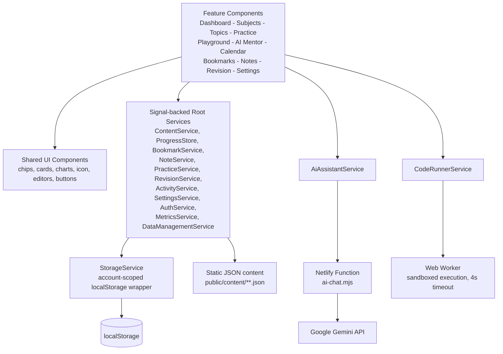
```mermaid
flowchart TD
    UI[Feature Components<br/>Dashboard - Subjects - Topics - Practice<br/>Playground - AI Mentor - Calendar<br/>Bookmarks - Notes - Revision - Settings]
    SHARED[Shared UI Components<br/>chips, cards, charts, icon, editors, buttons]
    SVC[Signal-backed Root Services<br/>ContentService, ProgressStore, BookmarkService,<br/>NoteService, PracticeService, RevisionService,<br/>ActivityService, SettingsService, AuthService,<br/>MetricsService, DataManagementService]
    STORE[StorageService<br/>account-scoped localStorage wrapper]
    LS[(localStorage)]
    CONTENT[Static JSON content<br/>public/content/**.json]
    AI[AiAssistantService]
    FN[Netlify Function<br/>ai-chat.mjs]
    GEMINI[Google Gemini API]
    RUNNER[CodeRunnerService]
    WORKER[Web Worker<br/>sandboxed execution, 4s timeout]

    UI --> SHARED
    UI --> SVC
    SVC --> STORE
    STORE --> LS
    SVC --> CONTENT
    UI --> AI
    AI --> FN
    FN --> GEMINI
    UI --> RUNNER
    RUNNER --> WORKER
```

### 4.2 Layering principles

- **Content vs. progress are strictly separate.** `ContentService` only ever reads static JSON; nothing it does can mutate user data, and none of the progress/bookmark/note/practice/revision services know or care how content was loaded. This is why Export/Import/Reset can touch *all* user data without any risk of also corrupting the app's content.
- **Signals for state, RxJS for async.** Every service's user-facing state is a `signal`/`computed`; RxJS (`HttpClient`, `switchMap`, `debounceTime`, `forkJoin`, `shareReplay`) is used only where something is genuinely asynchronous or stream-like (loading JSON over HTTP, the debounced search box, route-param-driven topic loading).
- **One storage indirection, not N.** Every service that persists data injects the same `StorageService` and calls `get`/`set` with its own `STORAGE_KEYS.*` constant — there is no per-service localStorage logic, so account-scoping ([§8.1](#81-account-scoping-mechanism)) is implemented exactly once.
- **Route-driven inputs over manual subscriptions.** `provideRouter(routes, withComponentInputBinding())` is enabled app-wide, so route params *and* query params bind directly to component `input()` signals (e.g., `topicId`, `subjectId`, `question` on `AiMentorComponent`) with no `ActivatedRoute` subscription boilerplate anywhere in the app.

### 4.3 Directory structure

```text
src/app/
  core/
    models/       Shared TypeScript interfaces — content, progress, filters, ai, auth (+ barrel index.ts)
    storage/      StorageService (account-scoped localStorage wrapper) + STORAGE_KEYS + scopedKey()
    guards/       authGuard, guestGuard
    services/     ContentService, ProgressStore, BookmarkService, NoteService, PracticeService,
                  RevisionService, SettingsService, MetricsService, DataManagementService,
                  AiAssistantService, AuthService, ActivityService, CodeRunnerService
    layout/       AppShell, Header (user menu, logout), Sidebar (search + nav), MobileNav, Search
  shared/
    components/   Reusable UI — see §10.1
    pipes/        MarkdownPipe
    markdown.ts   Hand-rolled markdown → HTML renderer
    date-key.ts   Local (non-UTC) day-key helpers used by Calendar/Activity
    subject-visuals.ts   Per-subject emoji/color lookup
  features/
    auth/ (auth-layout, login, register)   dashboard/   subjects/ (list, detail)   topics/ (topic-detail)
    practice/   playground/   ai-mentor/   calendar/   bookmarks/   notes/   revision/   settings/

public/content/
  subjects.json                             Subject + category + topic-summary metadata (all 5 subjects)
  angular/{topics,topics-extended}.json
  javascript/{topics,coding-practice,topics-extended}.json
  typescript/{topics,topics-extended}.json
  ui/{topics,topics-extended}.json
  system-design/topics.json

netlify/
  functions/ai-chat.mjs   Serverless AI proxy — the only place the Gemini API key is used
netlify.toml              Build config, SPA fallback redirect, /api/* → function redirect
```

---

## 5. Routing & navigation

### 5.1 Route table

All routes are lazy-loaded (`loadComponent`) so the initial bundle only contains the app shell. Every route except `/login`/`/register` requires `authGuard`; `/login`/`/register` use `guestGuard`.

| Path | Component | Guard | Notes |
|---|---|---|---|
| `/` | — | — | `redirectTo: 'dashboard'` (exact match only) |
| `/login` | `LoginComponent` | `guestGuard` | Accepts `?redirect=` |
| `/register` | `RegisterComponent` | `guestGuard` | |
| `/dashboard` | `DashboardComponent` | `authGuard` | |
| `/subjects` | `SubjectListComponent` | `authGuard` | |
| `/subjects/:subjectId` | `SubjectDetailComponent` | `authGuard` | |
| `/subjects/:subjectId/topics/:topicId` | `TopicDetailComponent` | `authGuard` | |
| `/ai-mentor` | `AiMentorComponent` | `authGuard` | Accepts `?subject=&topic=&subjectId=&topicId=&question=` |
| `/practice` | `PracticeComponent` | `authGuard` | Accepts `?subjectId=&topicId=` |
| `/playground` | `PlaygroundComponent` | `authGuard` | |
| `/calendar` | `CalendarComponent` | `authGuard` | |
| `/bookmarks` | `BookmarksComponent` | `authGuard` | |
| `/notes` | `NotesComponent` | `authGuard` | |
| `/revision` | `RevisionComponent` | `authGuard` | |
| `/settings` | `SettingsComponent` | `authGuard` | |
| `/**` | — | — | `redirectTo: 'dashboard'` |

### 5.2 Guards & redirect flow

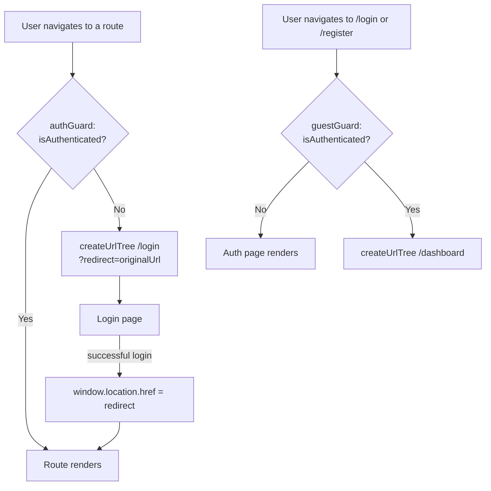
```mermaid
flowchart TD
    Nav[User navigates to a route] --> Check{authGuard:<br/>isAuthenticated?}
    Check -- Yes --> Render[Route renders]
    Check -- No --> ToLogin[createUrlTree /login<br/>?redirect=originalUrl]
    ToLogin --> LoginPage[Login page]
    LoginPage -- successful login --> HardRedirect[window.location.href = redirect]
    HardRedirect --> Render

    NavGuest[User navigates to /login or /register] --> CheckGuest{guestGuard:<br/>isAuthenticated?}
    CheckGuest -- No --> RenderAuth[Auth page renders]
    CheckGuest -- Yes --> ToDashboard[createUrlTree /dashboard]
```

### 5.3 Navigation components

- **Sidebar** (desktop) — search box + a fixed `NAV_ITEMS` list (Dashboard, Subjects, Practice, Playground, AI Mentor, Calendar, Bookmarks, Notes, Revision, Settings) + app version footer.
- **Mobile nav** (bottom bar, mobile) — a smaller always-visible set (Home, Subjects, Practice, AI Mentor) plus a "More" sheet (`moreOpen` signal) for the rest (Playground, Calendar, Bookmarks, Notes, Revision, Settings).
- Both navs are always in the DOM; CSS media queries (not `*ngIf`/JS) decide which is visible, so there's no layout flash on resize.
- **Header** — brand, global search, user-avatar dropdown (Settings link, Logout).
- **Search** — debounced (`debounceTime(250)` → `distinctUntilChanged()` → `switchMap`) global search over `ContentService.search()`, only fires for queries >1 character; dropdown closes 150ms after blur (long enough for a result click to register first).

---

## 6. State management

### 6.1 Pattern: signal-backed root services

Every stateful service follows the same shape:

```ts
@Injectable({ providedIn: 'root' })
export class SomeService {
  private readonly storage = inject(StorageService);
  private readonly _state = signal<T>(this.storage.get(STORAGE_KEYS.someKey, defaultValue));
  readonly state = this._state.asReadonly();     // public read-only signal
  // ...mutator methods call this._state.update()/.set(), then persist()
  replaceAll(value: T): void { ... }              // used by DataManagementService (import)
  resetAll(): void { ... }                        // used by DataManagementService (reset)
  private persist(): void { this.storage.set(STORAGE_KEYS.someKey, this._state()); }
}
```

Because it's `providedIn: 'root'`, each service is a **singleton for the whole app lifetime** — this is *why* login/logout force a hard page reload rather than trying to reset every service's in-memory signal individually (see [§8.1](#81-account-scoping-mechanism)).

### 6.2 Service catalog

| Service | Backing state | Storage key | Key methods |
|---|---|---|---|
| `AuthService` | `AuthState` (current user + flags) | `skill-hunter.auth-session`, `skill-hunter.auth-users` (unscoped — these *establish* the scope) | `register`, `login`, `logout`, `currentUserId()` |
| `ContentService` | `Map` caches (no localStorage) | — (HTTP + in-memory `shareReplay`) | `getSubjects`, `getSubject`, `getSubjectTopics`, `getTopic`, `search` |
| `ProgressStore` | `Record<topicId, TopicProgress>` | `interview-prep.progress` | `touchLastVisited`, `markComplete/Incomplete`, `setConfidence`, `toggleBlockComplete`, `incrementRevisionCount` |
| `BookmarkService` | `Bookmark[]` | `interview-prep.bookmarks` | `toggleTopicBookmark`, `toggleQuestionBookmark` |
| `NoteService` | `Record<topicId, Note>` | `interview-prep.notes` | `saveNote`, `appendToNote`, `deleteNote`, `getNote` |
| `PracticeService` | `PracticeAttempt[]` | `interview-prep.practice-history` | `buildQuestionPool`, `recordAttempt` |
| `RevisionService` | `string[]` (topic ids) | `interview-prep.revision-list` | `addToRevision`, `removeFromRevision`, `toggleRevision` |
| `ActivityService` | `Record<dateKey, seconds>` | `interview-prep.activity` | `minutesOn`, `currentStreak`, `longestStreak` (15s visibility-gated heartbeat) |
| `SettingsService` | `AppSettings` | `interview-prep.settings` | `toggleTheme`, `setDefaultDifficulty`, `setDailyGoalMinutes` |
| `MetricsService` | *(pure, no state)* | — | `computeCategoryMetrics`, `computeSubjectMetrics`, `computeDashboardMetrics`, `computeWeakTopics` |
| `DataManagementService` | *(pure, no state)* | — | `buildExport`, `downloadExport`, `importFromJson`, `resetAllProgress` |
| `AiAssistantService` | *(pure, no state)* | — | `sendMessage` (→ `POST /api/ai-chat`) |
| `CodeRunnerService` | *(pure, no state)* | — | `run(code)` (→ Web Worker) |
| `StorageService` | *(infra, no domain state)* | — | `get`, `set`, `remove`, `clear` — all transparently account-scoped |

### 6.3 Service dependency diagram

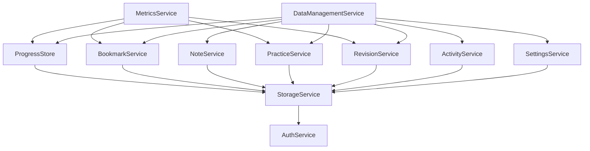
```mermaid
flowchart TD
    StorageService --> AuthService
    ProgressStore --> StorageService
    BookmarkService --> StorageService
    NoteService --> StorageService
    PracticeService --> StorageService
    RevisionService --> StorageService
    ActivityService --> StorageService
    SettingsService --> StorageService

    MetricsService --> ProgressStore
    MetricsService --> BookmarkService
    MetricsService --> PracticeService
    MetricsService --> RevisionService

    DataManagementService --> ProgressStore
    DataManagementService --> BookmarkService
    DataManagementService --> NoteService
    DataManagementService --> PracticeService
    DataManagementService --> RevisionService
    DataManagementService --> SettingsService
    DataManagementService --> ActivityService
```

---

## 7. Domain / data model

### 7.1 Content model (static, read-only)

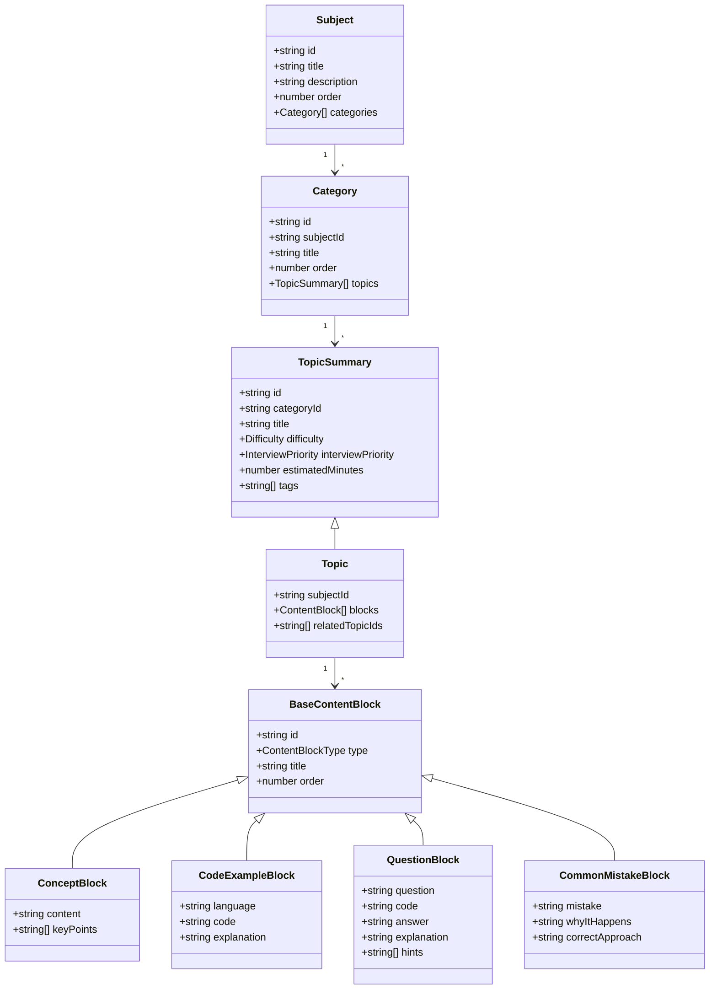
```mermaid
classDiagram
    class Subject {
      +string id
      +string title
      +string description
      +number order
      +Category[] categories
    }
    class Category {
      +string id
      +string subjectId
      +string title
      +number order
      +TopicSummary[] topics
    }
    class TopicSummary {
      +string id
      +string categoryId
      +string title
      +Difficulty difficulty
      +InterviewPriority interviewPriority
      +number estimatedMinutes
      +string[] tags
    }
    class Topic {
      +string subjectId
      +ContentBlock[] blocks
      +string[] relatedTopicIds
    }
    class BaseContentBlock {
      +string id
      +ContentBlockType type
      +string title
      +number order
    }
    class ConceptBlock {
      +string content
      +string[] keyPoints
    }
    class CodeExampleBlock {
      +string language
      +string code
      +string explanation
    }
    class QuestionBlock {
      +string question
      +string code
      +string answer
      +string explanation
      +string[] hints
    }
    class CommonMistakeBlock {
      +string mistake
      +string whyItHappens
      +string correctApproach
    }

    Subject "1" --> "*" Category
    Category "1" --> "*" TopicSummary
    TopicSummary <|-- Topic
    Topic "1" --> "*" BaseContentBlock
    BaseContentBlock <|-- ConceptBlock
    BaseContentBlock <|-- CodeExampleBlock
    BaseContentBlock <|-- QuestionBlock
    BaseContentBlock <|-- CommonMistakeBlock
```

`QuestionBlock.type` is one of four values: `output-question`, `interview-question`, `tricky-question`, `scenario-question` — same shape, different framing, driving different chip labels/icons in the UI.

### 7.2 User-generated data model

All of the following are independent flat stores, related only by convention (`topicId`/`subjectId` string fields) — there are no enforced foreign keys, since everything lives in separate `localStorage` entries.

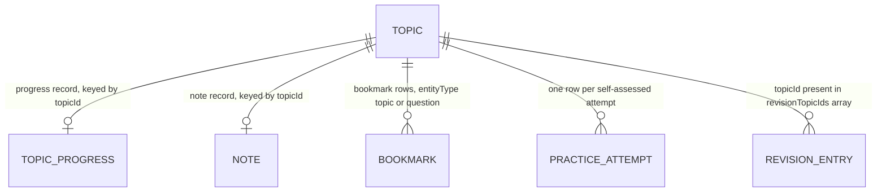
```mermaid
erDiagram
    TOPIC ||--o| TOPIC_PROGRESS : "progress record, keyed by topicId"
    TOPIC ||--o| NOTE : "note record, keyed by topicId"
    TOPIC ||--o{ BOOKMARK : "bookmark rows, entityType topic or question"
    TOPIC ||--o{ PRACTICE_ATTEMPT : "one row per self-assessed attempt"
    TOPIC ||--o{ REVISION_ENTRY : "topicId present in revisionTopicIds array"
```

| Model | Shape | Field summary |
|---|---|---|
| `TopicProgress` | `Record<topicId, TopicProgress>` | `topicId, subjectId, status ('not-started'\|'in-progress'\|'completed'), completedBlockIds[], confidence ('not-rated'\|'low'\|'medium'\|'high'), lastVisitedAt?, completedAt?, revisionCount` |
| `Bookmark` | flat array | `id ('${entityType}-${entityId}'), entityId, entityType ('topic'\|'question'), subjectId, topicId, createdAt` |
| `Note` | `Record<topicId, Note>` | `topicId, subjectId, content (markdown), updatedAt` |
| `PracticeAttempt` | flat array | `id, questionId, topicId, subjectId, result ('correct'\|'incorrect'\|'needs-revision'), attemptedAt, timeSpentSeconds?` |
| Revision list | `string[]` | topic ids only |
| `AppSettings` | single object | `theme, defaultDifficulty, showAnswersAutomatically, dailyGoalMinutes` |
| `ActivityLog` | `Record<dateKey, seconds>` | one entry per calendar day with any tracked activity |
| `StoredApplicationData` | export/import envelope | `version, progress, bookmarks, practiceHistory, revisionTopicIds, settings, activity?, notes?` |

### 7.3 Auth model

| Model | Scope | Shape |
|---|---|---|
| `AuthUser` | public-safe, shared | `id, name, email, createdAt` |
| `RegisteredUser` | private to `auth.service.ts`, never exported | `AuthUser` fields + `passwordHash, passwordSalt` |
| `AuthState` | app-wide signal | `user: AuthUser \| null, isAuthenticated, isLoading, error` |

---

## 8. Storage design

### 8.1 Account scoping mechanism

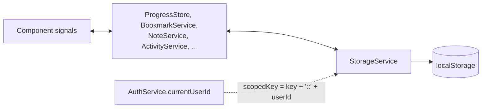
```mermaid
flowchart LR
    Comp[Component signals] <--> Svc[ProgressStore, BookmarkService,<br/>NoteService, ActivityService, ...]
    Svc <--> Store[StorageService]
    Auth[AuthService.currentUserId] -.scopedKey = key + '::' + userId.-> Store
    Store --> LS[(localStorage)]
```

`StorageService.get/set/remove` all funnel through a private `scoped(key)` that calls `scopedKey(key, authService.currentUserId())` — `key::<userId>` if signed in, or the bare key if not. This one function is the entirety of the multi-account isolation mechanism; no individual service is aware accounts exist.

Because each service's backing signal is initialized **once**, at construction time, from whatever account is current at that moment, switching accounts mid-session without a page reload would leave stale data in memory — which is exactly why login/logout/register all force `window.location.href` instead of `router.navigate` ([§2.1](#21-accounts--authentication)).

### 8.2 Storage key registry

| Key constant | localStorage key (unscoped form) | Written by |
|---|---|---|
| `STORAGE_KEYS.progress` | `interview-prep.progress` | `ProgressStore` |
| `STORAGE_KEYS.bookmarks` | `interview-prep.bookmarks` | `BookmarkService` |
| `STORAGE_KEYS.practiceHistory` | `interview-prep.practice-history` | `PracticeService` |
| `STORAGE_KEYS.settings` | `interview-prep.settings` | `SettingsService` |
| `STORAGE_KEYS.revisionList` | `interview-prep.revision-list` | `RevisionService` |
| `STORAGE_KEYS.activity` | `interview-prep.activity` | `ActivityService` |
| `STORAGE_KEYS.notes` | `interview-prep.notes` | `NoteService` |
| *(unscoped, not in `STORAGE_KEYS`)* | `skill-hunter.auth-session` | `AuthService` — current session |
| *(unscoped, not in `STORAGE_KEYS`)* | `skill-hunter.auth-users` | `AuthService` — full account list |

`CURRENT_DATA_VERSION = 1` (`storage-keys.ts`) is carried in every export file for future migrations; none exist yet.

### 8.3 Legacy data migration

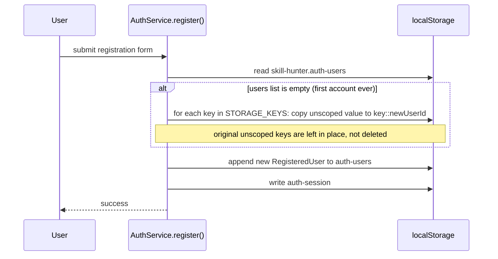
```mermaid
sequenceDiagram
    participant U as User
    participant A as AuthService.register()
    participant L as localStorage

    U->>A: submit registration form
    A->>L: read skill-hunter.auth-users
    alt users list is empty (first account ever)
        A->>L: for each key in STORAGE_KEYS: copy unscoped value to key::newUserId
        Note over A,L: original unscoped keys are left in place, not deleted
    end
    A->>L: append new RegisteredUser to auth-users
    A->>L: write auth-session
    A-->>U: success
```

This guarantees that turning on multi-account support after a period of single-user (unscoped) use never looks like data loss to whoever registers first on that browser.

### 8.4 Export / import format

`StoredApplicationData` (§7.2) is the entire export payload — a single JSON file containing every user-data store except the account/session itself (accounts are intentionally *not* exportable/importable, to avoid silently merging two different people's credentials). `DataManagementService.importFromJson()` validates structure (`isValidStoredData` — checks every field's type, including rejecting `null`/arrays masquerading as objects) before calling each service's `replaceAll()`.

---

## 9. Core flows (sequence diagrams)

### 9.1 Registration

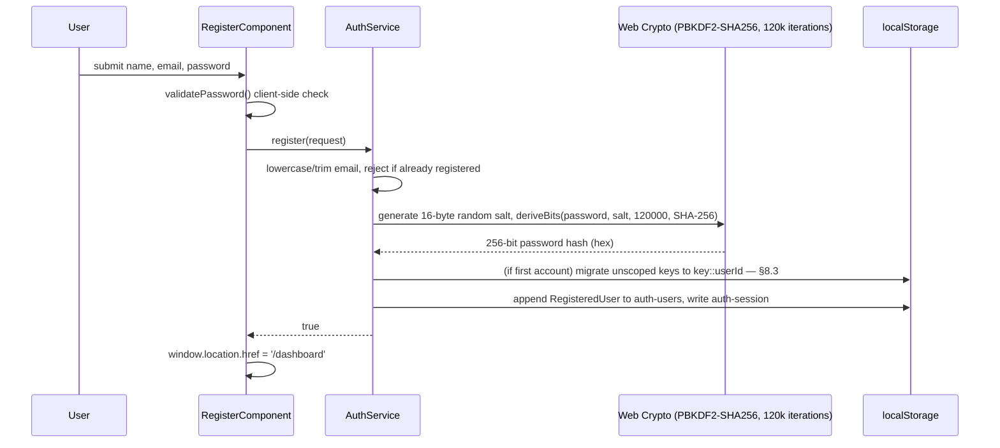
```mermaid
sequenceDiagram
    participant U as User
    participant P as RegisterComponent
    participant A as AuthService
    participant W as Web Crypto (PBKDF2-SHA256, 120k iterations)
    participant L as localStorage

    U->>P: submit name, email, password
    P->>P: validatePassword() client-side check
    P->>A: register(request)
    A->>A: lowercase/trim email, reject if already registered
    A->>W: generate 16-byte random salt, deriveBits(password, salt, 120000, SHA-256)
    W-->>A: 256-bit password hash (hex)
    A->>L: (if first account) migrate unscoped keys to key::userId — §8.3
    A->>L: append RegisteredUser to auth-users, write auth-session
    A-->>P: true
    P->>P: window.location.href = '/dashboard'
```

### 9.2 Login

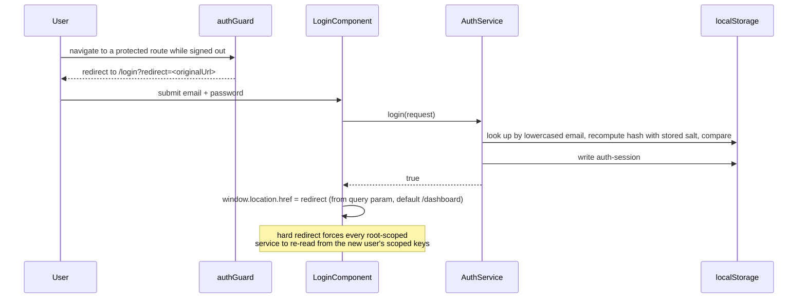
```mermaid
sequenceDiagram
    participant U as User
    participant G as authGuard
    participant P as LoginComponent
    participant A as AuthService
    participant L as localStorage

    U->>G: navigate to a protected route while signed out
    G-->>U: redirect to /login?redirect=<originalUrl>
    U->>P: submit email + password
    P->>A: login(request)
    A->>L: look up by lowercased email, recompute hash with stored salt, compare
    A->>L: write auth-session
    A-->>P: true
    P->>P: window.location.href = redirect (from query param, default /dashboard)
    Note over P: hard redirect forces every root-scoped<br/>service to re-read from the new user's scoped keys
```

### 9.3 Logout

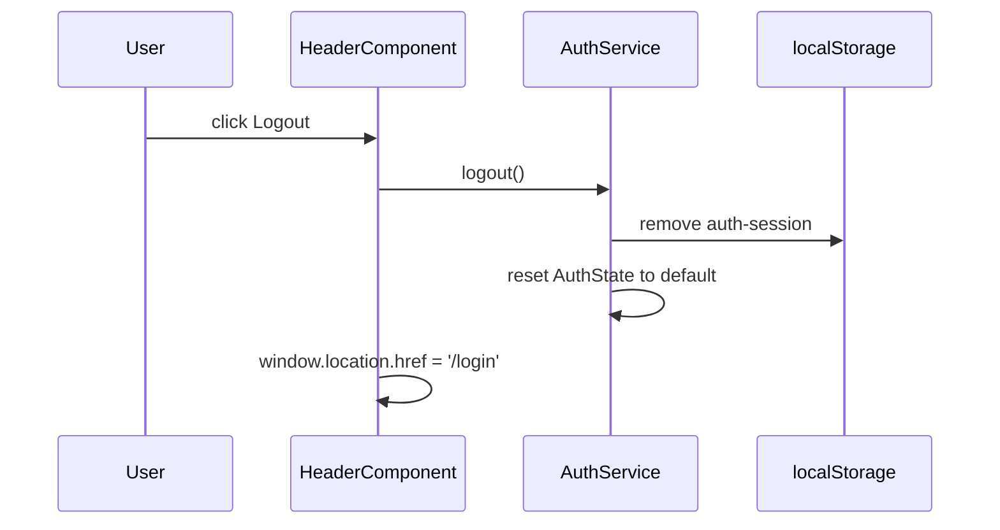
```mermaid
sequenceDiagram
    participant U as User
    participant H as HeaderComponent
    participant A as AuthService
    participant L as localStorage

    U->>H: click Logout
    H->>A: logout()
    A->>L: remove auth-session
    A->>A: reset AuthState to default
    H->>H: window.location.href = '/login'
```

### 9.4 Reading a topic & progress tracking

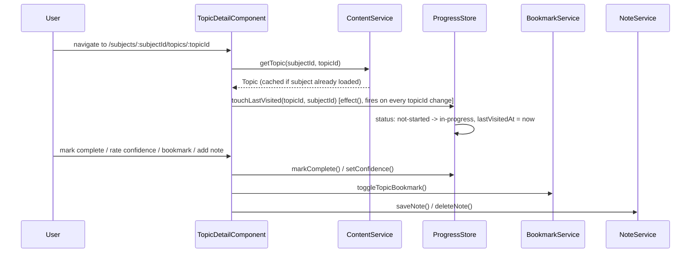
```mermaid
sequenceDiagram
    participant U as User
    participant T as TopicDetailComponent
    participant C as ContentService
    participant P as ProgressStore
    participant B as BookmarkService
    participant N as NoteService

    U->>T: navigate to /subjects/:subjectId/topics/:topicId
    T->>C: getTopic(subjectId, topicId)
    C-->>T: Topic (cached if subject already loaded)
    T->>P: touchLastVisited(topicId, subjectId)  [effect(), fires on every topicId change]
    P->>P: status: not-started -> in-progress, lastVisitedAt = now
    U->>T: mark complete / rate confidence / bookmark / add note
    T->>P: markComplete() / setConfidence()
    T->>B: toggleTopicBookmark()
    T->>N: saveNote() / deleteNote()
```

### 9.5 Personal notes

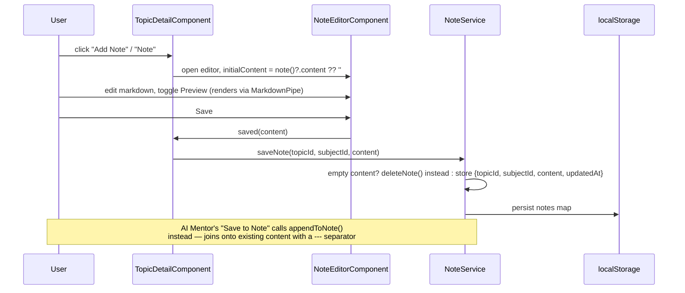
```mermaid
sequenceDiagram
    participant U as User
    participant T as TopicDetailComponent
    participant E as NoteEditorComponent
    participant N as NoteService
    participant L as localStorage

    U->>T: click "Add Note" / "Note"
    T->>E: open editor, initialContent = note()?.content ?? ''
    U->>E: edit markdown, toggle Preview (renders via MarkdownPipe)
    U->>E: Save
    E->>T: saved(content)
    T->>N: saveNote(topicId, subjectId, content)
    N->>N: empty content? deleteNote() instead : store {topicId, subjectId, content, updatedAt}
    N->>L: persist notes map
    Note over U,N: AI Mentor's "Save to Note" calls appendToNote()<br/>instead — joins onto existing content with a --- separator
```

### 9.6 Practice session

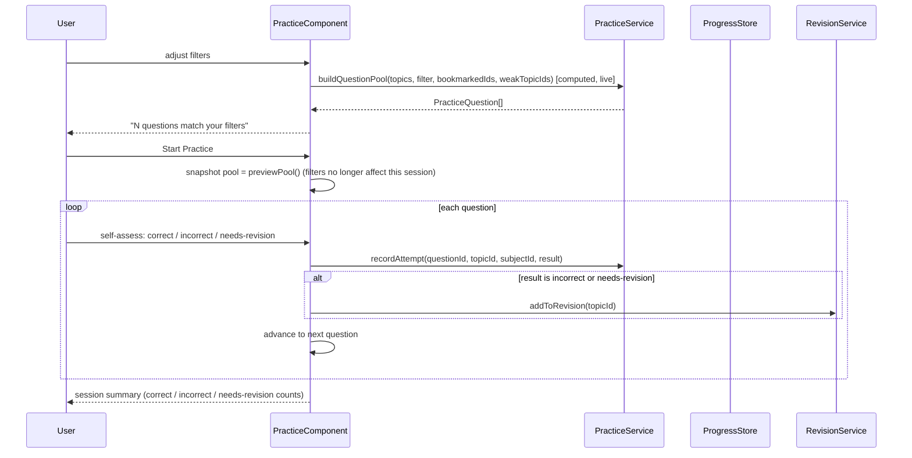
```mermaid
sequenceDiagram
    participant U as User
    participant P as PracticeComponent
    participant PS as PracticeService
    participant PR as ProgressStore
    participant RV as RevisionService

    U->>P: adjust filters
    P->>PS: buildQuestionPool(topics, filter, bookmarkedIds, weakTopicIds) [computed, live]
    PS-->>P: PracticeQuestion[]
    P-->>U: "N questions match your filters"
    U->>P: Start Practice
    P->>P: snapshot pool = previewPool() (filters no longer affect this session)
    loop each question
        U->>P: self-assess: correct / incorrect / needs-revision
        P->>PS: recordAttempt(questionId, topicId, subjectId, result)
        alt result is incorrect or needs-revision
            P->>RV: addToRevision(topicId)
        end
        P->>P: advance to next question
    end
    P-->>U: session summary (correct / incorrect / needs-revision counts)
```

### 9.7 Playground sandbox execution

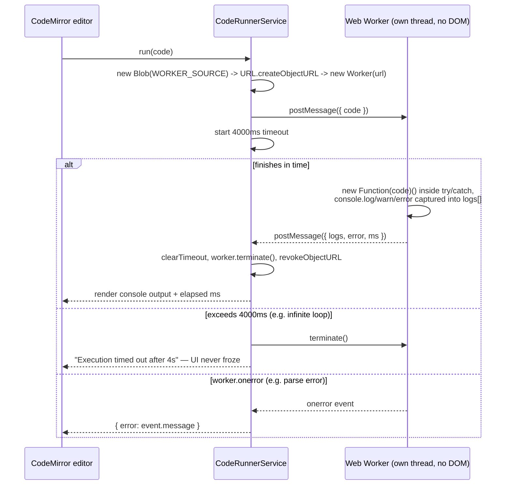
```mermaid
sequenceDiagram
    participant E as CodeMirror editor
    participant C as CodeRunnerService
    participant W as Web Worker (own thread, no DOM)

    E->>C: run(code)
    C->>C: new Blob(WORKER_SOURCE) -> URL.createObjectURL -> new Worker(url)
    C->>W: postMessage({ code })
    C->>C: start 4000ms timeout
    alt finishes in time
        W->>W: new Function(code)() inside try/catch,<br/>console.log/warn/error captured into logs[]
        W-->>C: postMessage({ logs, error, ms })
        C->>C: clearTimeout, worker.terminate(), revokeObjectURL
        C-->>E: render console output + elapsed ms
    else exceeds 4000ms (e.g. infinite loop)
        C->>W: terminate()
        C-->>E: "Execution timed out after 4s" — UI never froze
    else worker.onerror (e.g. parse error)
        W-->>C: onerror event
        C-->>E: { error: event.message }
    end
```

### 9.8 AI Mentor request

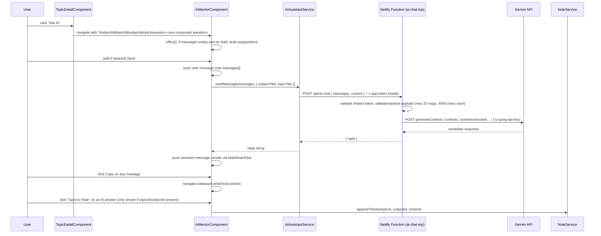
```mermaid
sequenceDiagram
    participant U as User
    participant T as TopicDetailComponent
    participant M as AiMentorComponent
    participant S as AiAssistantService
    participant N as Netlify Function (ai-chat.mjs)
    participant G as Gemini API
    participant NS as NoteService

    U->>T: click "Ask AI"
    T->>M: navigate with ?subjectId&topicId&subject&topic&question=<pre-composed question>
    M->>M: effect(): if messages empty and no draft, draft.set(question)
    U->>M: (edit if desired) Send
    M->>M: push user message onto messages[]
    M->>S: sendMessage(messages, { subjectTitle, topicTitle })
    S->>N: POST /api/ai-chat { messages, context } + x-app-token header
    N->>N: validate shared token, validate/sanitize payload (max 20 msgs, 4000 chars each)
    N->>G: POST generateContent { contents, systemInstruction, ... } (x-goog-api-key)
    G-->>N: candidate response
    N-->>S: { reply }
    S-->>M: reply string
    M->>M: push assistant message, render via MarkdownPipe
    U->>M: click Copy on any message
    M->>M: navigator.clipboard.writeText(content)
    U->>M: click "Save to Note" on an AI answer (only shown if topicId/subjectId present)
    M->>NS: appendToNote(topicId, subjectId, content)
```

### 9.9 Calendar activity tracking & heatmap

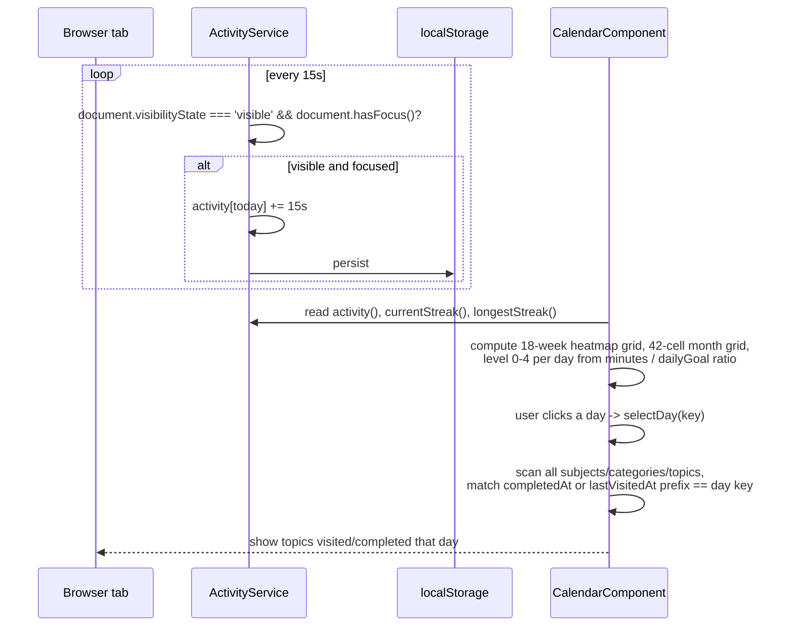
```mermaid
sequenceDiagram
    participant Tab as Browser tab
    participant A as ActivityService
    participant L as localStorage
    participant Cal as CalendarComponent

    loop every 15s
        A->>A: document.visibilityState === 'visible' && document.hasFocus()?
        alt visible and focused
            A->>A: activity[today] += 15s
            A->>L: persist
        end
    end
    Cal->>A: read activity(), currentStreak(), longestStreak()
    Cal->>Cal: compute 18-week heatmap grid, 42-cell month grid,<br/>level 0-4 per day from minutes / dailyGoal ratio
    Cal->>Cal: user clicks a day -> selectDay(key)
    Cal->>Cal: scan all subjects/categories/topics,<br/>match completedAt or lastVisitedAt prefix == day key
    Cal-->>Tab: show topics visited/completed that day
```

### 9.10 Dashboard metrics aggregation

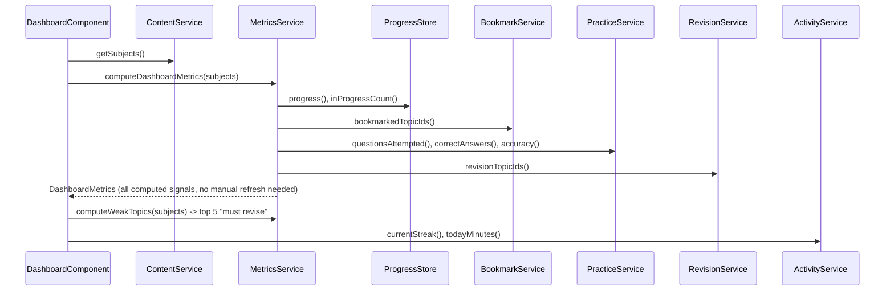
```mermaid
sequenceDiagram
    participant D as DashboardComponent
    participant C as ContentService
    participant Me as MetricsService
    participant P as ProgressStore
    participant B as BookmarkService
    participant Pr as PracticeService
    participant R as RevisionService
    participant Ac as ActivityService

    D->>C: getSubjects()
    D->>Me: computeDashboardMetrics(subjects)
    Me->>P: progress(), inProgressCount()
    Me->>B: bookmarkedTopicIds()
    Me->>Pr: questionsAttempted(), correctAnswers(), accuracy()
    Me->>R: revisionTopicIds()
    Me-->>D: DashboardMetrics (all computed signals, no manual refresh needed)
    D->>Me: computeWeakTopics(subjects) -> top 5 "must revise"
    D->>Ac: currentStreak(), todayMinutes()
```

### 9.11 Export / import / reset

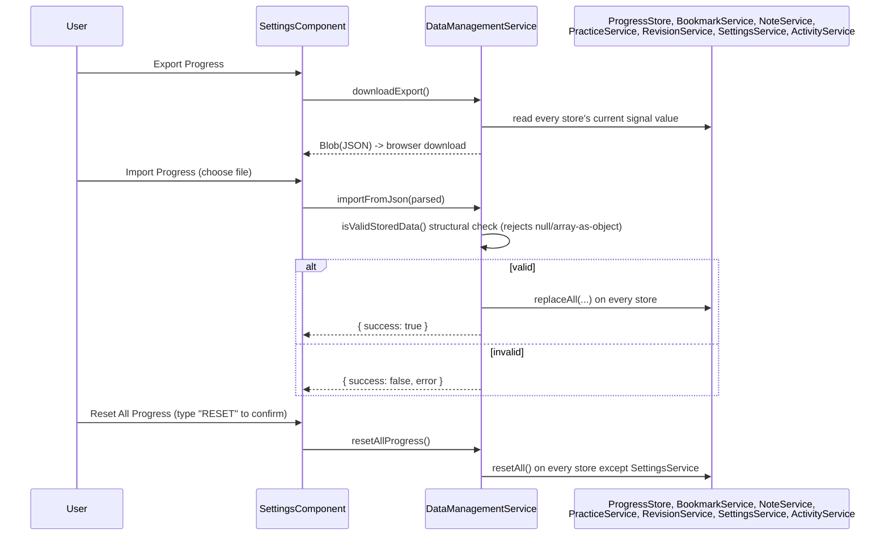
```mermaid
sequenceDiagram
    participant U as User
    participant S as SettingsComponent
    participant D as DataManagementService
    participant Svcs as ProgressStore, BookmarkService, NoteService,<br/>PracticeService, RevisionService, SettingsService, ActivityService

    U->>S: Export Progress
    S->>D: downloadExport()
    D->>Svcs: read every store's current signal value
    D-->>S: Blob(JSON) -> browser download

    U->>S: Import Progress (choose file)
    S->>D: importFromJson(parsed)
    D->>D: isValidStoredData() structural check (rejects null/array-as-object)
    alt valid
        D->>Svcs: replaceAll(...) on every store
        D-->>S: { success: true }
    else invalid
        D-->>S: { success: false, error }
    end

    U->>S: Reset All Progress (type "RESET" to confirm)
    S->>D: resetAllProgress()
    D->>Svcs: resetAll() on every store except SettingsService
```

### 9.12 Content loading & caching

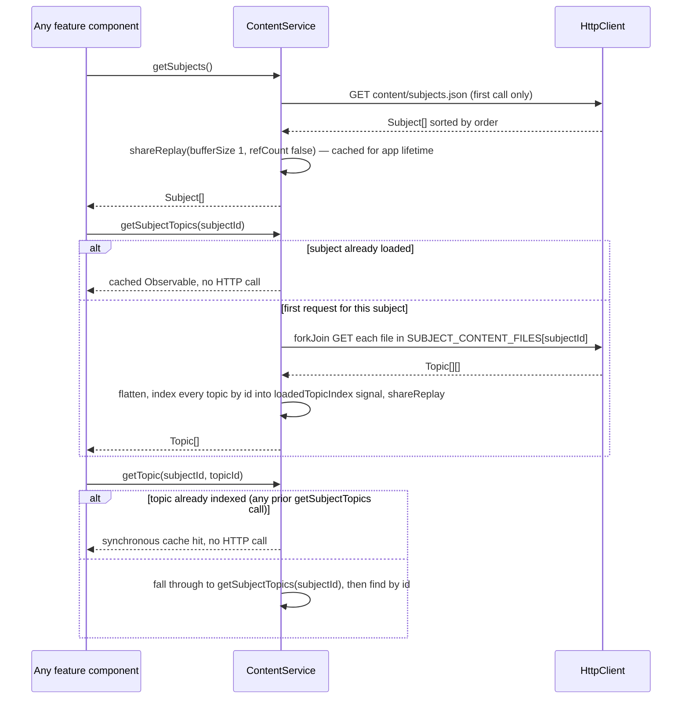
```mermaid
sequenceDiagram
    participant Comp as Any feature component
    participant C as ContentService
    participant H as HttpClient

    Comp->>C: getSubjects()
    C->>H: GET content/subjects.json (first call only)
    H-->>C: Subject[] sorted by order
    C->>C: shareReplay(bufferSize 1, refCount false) — cached for app lifetime
    C-->>Comp: Subject[]

    Comp->>C: getSubjectTopics(subjectId)
    alt subject already loaded
        C-->>Comp: cached Observable, no HTTP call
    else first request for this subject
        C->>H: forkJoin GET each file in SUBJECT_CONTENT_FILES[subjectId]
        H-->>C: Topic[][]
        C->>C: flatten, index every topic by id into loadedTopicIndex signal, shareReplay
        C-->>Comp: Topic[]
    end

    Comp->>C: getTopic(subjectId, topicId)
    alt topic already indexed (any prior getSubjectTopics call)
        C-->>Comp: synchronous cache hit, no HTTP call
    else
        C->>C: fall through to getSubjectTopics(subjectId), then find by id
    end
```

### 9.13 Global search

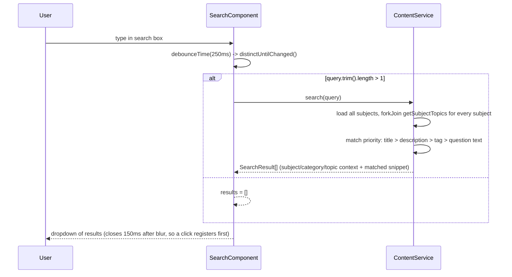
```mermaid
sequenceDiagram
    participant U as User
    participant S as SearchComponent
    participant C as ContentService

    U->>S: type in search box
    S->>S: debounceTime(250ms) -> distinctUntilChanged()
    alt query.trim().length > 1
        S->>C: search(query)
        C->>C: load all subjects, forkJoin getSubjectTopics for every subject
        C->>C: match priority: title > description > tag > question text
        C-->>S: SearchResult[] (subject/category/topic context + matched snippet)
    else
        S-->>S: results = []
    end
    S-->>U: dropdown of results (closes 150ms after blur, so a click registers first)
```

---

## 10. Component catalog

### 10.1 Shared / reusable components (`src/app/shared/components/`)

| Component | Purpose |
|---|---|
| `IconComponent` | Renders one of a fixed set of inlined SVG paths (`icon-paths.ts`) by name; `filled` input toggles solid vs. outline |
| `BreadcrumbComponent` | Simple `label + optional routerLink[]` trail |
| `EmptyStateComponent` | Standard "nothing here yet" placeholder (title + message + optional CTA slot) |
| `DifficultyChipComponent` / `PriorityChipComponent` | Colored status chips for a topic's difficulty / interview priority |
| `TopicCardComponent` / `SubjectCardComponent` | Grid-card summaries with progress state |
| `QuestionCardComponent` | Renders one question block with hide/reveal (via `AnswerRevealComponent`), bookmark toggle |
| `AnswerRevealComponent` | Hide-until-clicked answer/explanation panel |
| `CodeBlockComponent` | Syntax-styled code display with a Copy button (`navigator.clipboard`, 1.5s "Copied!" state) |
| `ConfidenceSelectorComponent` | 4-way confidence rating control |
| `CompletionButtonComponent` | Mark complete/incomplete toggle |
| `BookmarkButtonComponent` | Bookmark toggle (icon + label, active-state styling) |
| `NoteButtonComponent` | Note indicator/open-editor button (mirrors `BookmarkButtonComponent`'s pattern) |
| `NoteEditorComponent` | Edit/Preview markdown note editor with Save/Delete/Close |
| `FilterPanelComponent` | Shared filter-controls layout used by Subject Detail and Practice |
| `SearchResultComponent` | One row in the header search dropdown |
| `DonutChartComponent` / `BarChartComponent` / `ProgressBarComponent` | Dashboard chart primitives, CSS/SVG-based, no charting library |

### 10.2 Feature components (`src/app/features/`)

| Feature | Component(s) | Summary |
|---|---|---|
| Auth | `AuthLayoutComponent`, `LoginComponent`, `RegisterComponent` | See [§2.1](#21-accounts--authentication), [§9.1](#91-registration)–[§9.3](#93-logout) |
| Dashboard | `DashboardComponent` | See [§2.2](#22-dashboard), [§9.10](#910-dashboard-metrics-aggregation) |
| Subjects | `SubjectListComponent`, `SubjectDetailComponent` | See [§2.3](#23-subjects--topics) |
| Topics | `TopicDetailComponent` | See [§2.3](#23-subjects--topics), [§9.4](#94-reading-a-topic--progress-tracking) |
| Practice | `PracticeComponent` | See [§2.4](#24-practice-mode), [§9.6](#96-practice-session) |
| Playground | `PlaygroundComponent` | See [§2.5](#25-javascript-playground), [§9.7](#97-playground-sandbox-execution) |
| AI Mentor | `AiMentorComponent` | See [§2.6](#26-ai-mentor), [§9.8](#98-ai-mentor-request) |
| Notes | `NotesComponent` | See [§2.7](#27-personal-notes), [§9.5](#95-personal-notes) |
| Bookmarks | `BookmarksComponent` | See [§2.8](#28-bookmarks) |
| Revision | `RevisionComponent` | See [§2.9](#29-revision) |
| Calendar | `CalendarComponent` | See [§2.10](#210-study-calendar), [§9.9](#99-calendar-activity-tracking--heatmap) |
| Settings | `SettingsComponent` | See [§2.11](#211-settings--data-management), [§9.11](#911-export--import--reset) |

---

## 11. Cross-cutting concerns

### 11.1 Error handling & resilience

| Failure mode | Handling |
|---|---|
| Corrupted JSON in a localStorage key | `StorageService.get()` catches the parse error, logs a warning, removes the bad key, returns the caller's fallback — the app never crashes on corrupt local data |
| Import file is structurally invalid | `isValidStoredData()` rejects it (including `null`/array masquerading as an object) before any store is touched; a clear inline error is shown, no partial import |
| AI backend not configured (missing `GEMINI_API_KEY`) | Function returns 503 with a specific setup-instructions message |
| AI daily quota exhausted | Function detects upstream 429 and returns a distinct, non-retryable message |
| AI reply hits the token limit | Function appends a "(reply hit the length limit — ask me to continue)" note rather than silently truncating |
| Playground code throws or never returns | Worker `try/catch` + a 4-second hard timeout with forced `terminate()` — the tab never freezes |
| Playground worker fails to even start (parse error) | `worker.onerror` handled explicitly, surfaced as a normal error result |

### 11.2 Security considerations

- **Password hashing is real but the account system is not a security boundary.** PBKDF2-SHA256, 120,000 iterations, random 16-byte salt per user, native Web Crypto — but there's no server validating anything, and the hashed account list is inspectable via browser dev tools by anyone with access to that browser profile. This is explicitly documented as a local-demo-account model, not real auth.
- **AI API key never reaches the browser.** The Netlify function is the only place `GEMINI_API_KEY` is read (`process.env`); the client only ever holds `APP_SHARED_TOKEN`, which is a bot deterrent, not a secret (it ships in the built JS bundle).
- **XSS-safe markdown rendering.** `src/app/shared/markdown.ts` escapes `&`/`<`/`>` in the raw input *before* introducing any HTML tags, and only ever emits a small fixed set of tags it constructs itself — safe to pipe LLM output straight into `[innerHTML]` via `DomSanitizer.bypassSecurityTrustHtml`.
- **Per-account data isolation** is enforced structurally (every key is namespaced by user id), not by any access-control check — there's no scenario where account A's code could accidentally read account B's key, since the key literally doesn't exist under A's namespace.

### 11.3 Performance

- Every feature route is lazy-loaded (`loadComponent`); CodeMirror is additionally isolated to the Playground route so its ~500KB chunk never loads for anyone not visiting `/playground`.
- `ContentService` caches both the subject list and each subject's topics with `shareReplay({ refCount: false })` — a subject's JSON is fetched over the network at most once per app session, no matter how many components request it.
- Search is debounced (250ms) and short-circuits below 2 characters, avoiding a full subject/topic scan on every keystroke.
- Dashboard/Practice/Calendar widgets are all `computed()` signals — Angular only recomputes what actually changed, and only re-renders components that read the specific signal that changed.

### 11.4 Responsive design & theming

- Mobile-first SCSS via `respond-to()` in `src/styles/_breakpoints.scss`.
- Sidebar (desktop) and bottom nav (mobile) are both always in the DOM; visibility is CSS-only, avoiding any resize-triggered layout flash.
- Theme is a `data-theme` attribute on `<html>`, driven by `SettingsService` and persisted — light/dark CSS custom properties are defined once in `src/styles/_variables.scss` (including the danger/primary gradient tokens used for destructive vs. primary buttons) and consumed everywhere via `var(--...)`.
- Sticky footer via the standard `margin-top: auto` flexbox technique.

### 11.5 Accessibility notes

Partial, not a dedicated audit: interactive icon-only buttons use `aria-label`/`aria-pressed` (e.g. `BookmarkButtonComponent`, `NoteButtonComponent`), focus-visible outlines are centralized in a `focus-ring` SCSS mixin applied to all custom buttons/inputs, and touch targets use a `touch-target` mixin (44×44px minimum). There is no dedicated accessibility test pass.

### 11.6 Testing

The project uses **Vitest** as its test runner (Angular 22's default), but actual coverage is minimal — only the default `src/app/app.spec.ts` scaffold exists at the time of writing; no service or component has dedicated unit tests yet. This is a known gap, not a design decision — see [§13](#13-known-limitations).

---

## 12. Build & deployment

### 12.1 Scripts (`package.json`)

| Script | Command | Purpose |
|---|---|---|
| `npm start` | `ng serve` | Dev server, port 4200, live reload — AI Mentor will show a "can't reach backend" message here since the Netlify function isn't running |
| `ng build` | production build | Output to `dist/skill-hunter` |
| `ng build --configuration development` | unminified build | Debugging a deployed build |
| `ng test` | Vitest | Runs the (currently minimal) unit test suite |
| `netlify dev` | Angular dev server + emulated function, proxied on port 8888 | Only way to exercise `/api/ai-chat` locally |

### 12.2 `netlify.toml`

```toml
[build]
  command = "npm run build"
  publish = "dist/skill-hunter/browser"
  functions = "netlify/functions"

[[redirects]]
  from = "/api/*"
  to = "/.netlify/functions/:splat"
  status = 200

[[redirects]]
  from = "/*"
  to = "/index.html"
  status = 200
```

The second redirect is the standard Angular SPA fallback (deep links like `/subjects/angular/topics/x` must resolve to `index.html` so the Angular router can take over client-side).

### 12.3 Deployment architecture

```mermaid
flowchart LR
    Dev[git push] --> Netlify[Netlify build:<br/>npm run build]
    Netlify --> Static[Static hosting<br/>dist/skill-hunter/browser]
    Netlify --> Func[Netlify Functions<br/>ai-chat.mjs]
    Browser[User's browser] --> Static
    Browser -->|POST /api/ai-chat| Func
    Func -->|x-goog-api-key, server-side only| Gemini[Google Gemini API]
```

Any static host (Vercel, GitHub Pages, S3+CloudFront) works for the entire app **except** AI Mentor, which needs an equivalent serverless-function mechanism on that platform.

### 12.4 Local AI development setup

```bash
npm install -g netlify-cli   # one-time
cp .env.example .env         # fill in GEMINI_API_KEY, APP_SHARED_TOKEN — .env is git-ignored
netlify dev
```

---

## 13. Known limitations

- No cloud sync/database — all progress is local to one browser, scoped per account (§8.1). The only server-side component is the stateless AI proxy function, which persists no user data.
- The account system is a real client-side implementation but not a real security boundary (§11.2).
- Starter content (78 topics) is a seed set, not the full target library — extending it is JSON-only, no code changes required (see the "Adding content" section of the [README](../README.md)).
- AI Mentor responses are not streamed — a full reply arrives at once.
- No automated test coverage beyond the default scaffold (§11.6).
- No accessibility audit has been performed (§11.5).

---

## 14. Appendix

### A. Full storage key reference

See [§8.2](#82-storage-key-registry).

### B. Full route reference

See [§5.1](#51-route-table).

### C. Glossary

| Term | Meaning |
|---|---|
| **Account-scoped key** | A localStorage key suffixed with `::<userId>`, so each signed-in account has its own copy of every data store |
| **Content block** | One unit of a topic's body — concept, code example, one of four question types, or a common-mistake callout |
| **Weak topic** | A topic flagged by any of: low confidence, an incorrect/needs-revision practice attempt, manual revision add, or bookmark |
| **Signal-backed service** | A root-provided Angular service whose state is a `signal`, persisted to `localStorage` on every mutation |
| **Hard redirect** | `window.location.href = ...` instead of `router.navigate(...)` — forces a full app reload so root-scoped services re-initialize from the correct account's storage keys |
